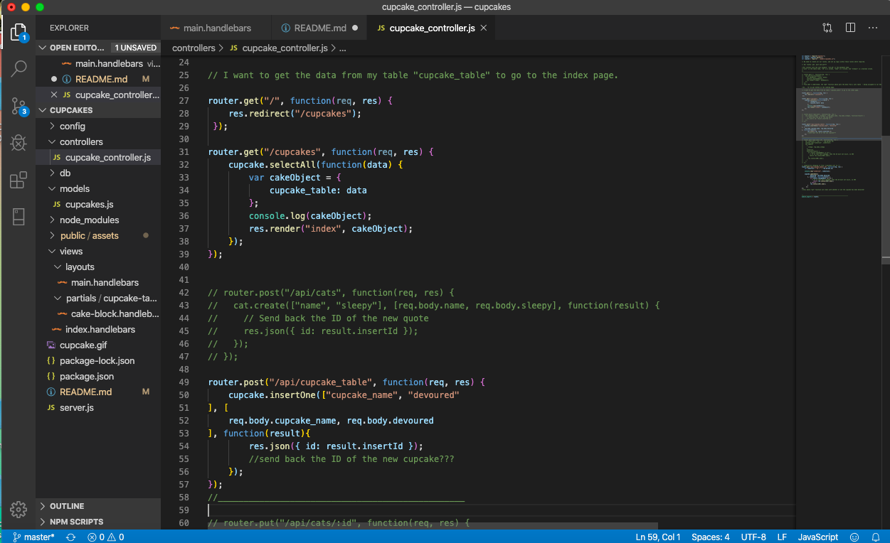
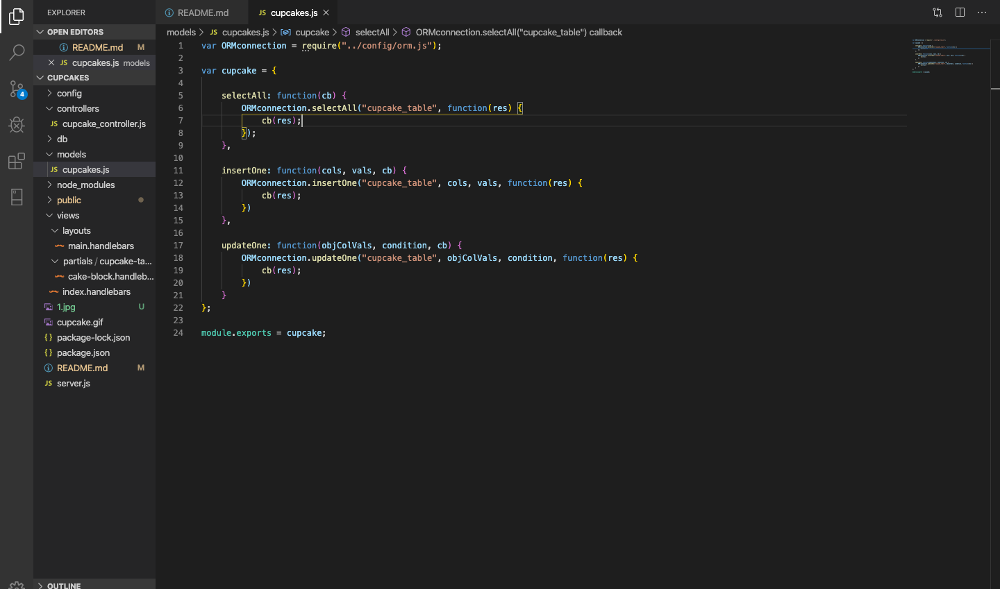
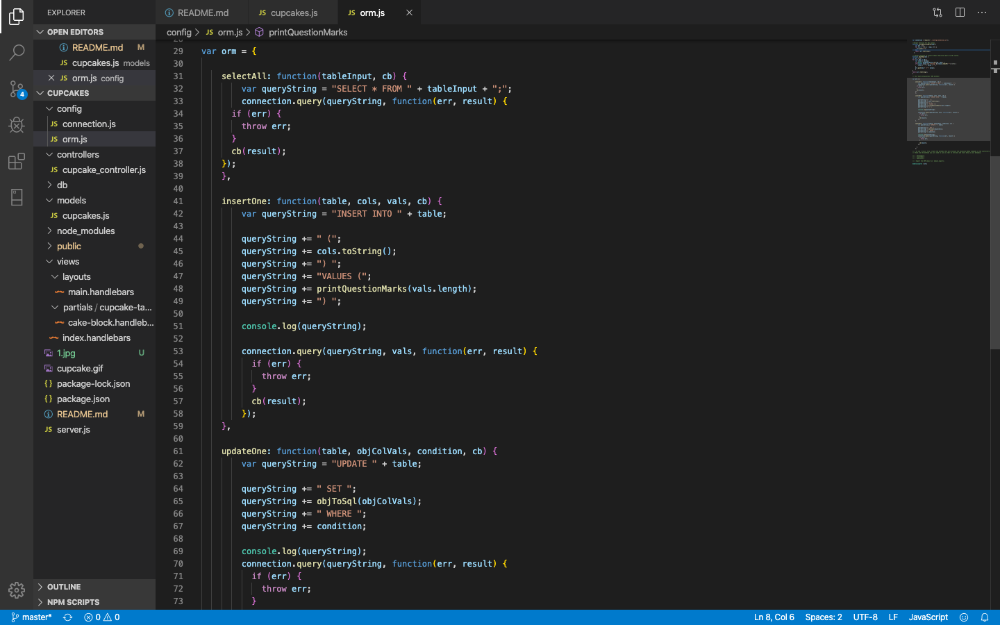
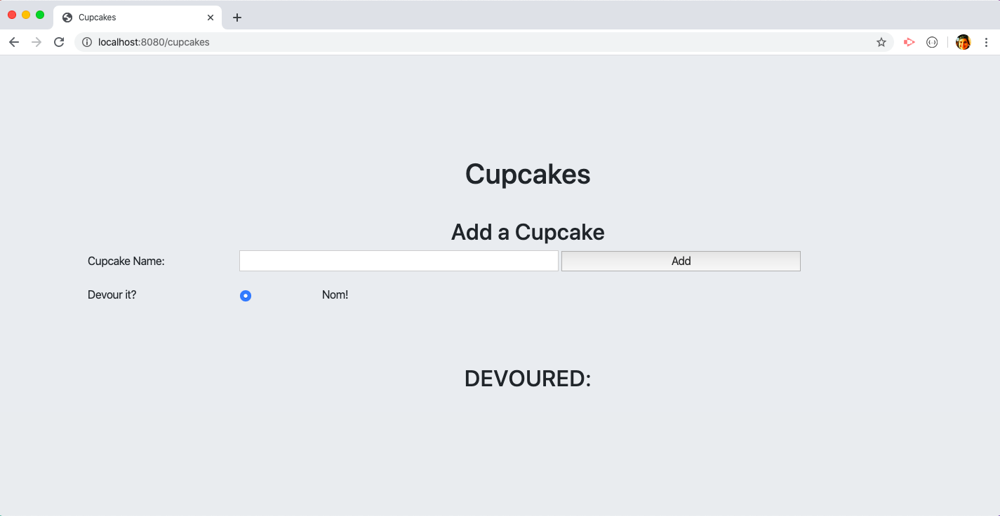

# MySQL Employee Tracker

### Heroku Deployed Application
https://intense-falls-86152.herokuapp.com/cupcakes

### GH Pages URL: https://pmahalan.github.io/MVC_hw_13/

My purpose in building this was to create a full-stack web application which references a MySQL database. I chose to make my database a variety of cupcakes, which in turn are to be displayed on the front-end side of the application. Upon successful development of all the app's features, the user will be able to click on a button next to any given cupcake to "Devour" it; this will change the status of that particular cupcake in the database from "not devoured" to "Devoured". Additionally, upon the successful development of all the app's features, the user will be able to add their own cupcake names to the database. 

After some de-bugging, I was successful in getting the content which was pre-coded into the MySQL database to be displayed on the front-end. Gaps in functionality remain, however, in user interactivity. Text entered into the search field is not being added to the MySQL database upon the clicking of the "add" button (and therefore isn't being added to the front-end list either), and clicking on the "devour" button does not change the positioning or the status of any of the cupcakes.

Additionally, this application utlizes ORM (object-relational mapping). The aim of the ORM methods in general is to help "convert data between incompatible type systems", and within the app specifically, to help convert data from my database (MySQL) to HTML.

For the display of my application, I chose to use the Bootstrap CSS framework. In addition to having my page elements center-aligned, I hope that the use of Bootstrap will contribute to a clean-cut and polished look for my application.

